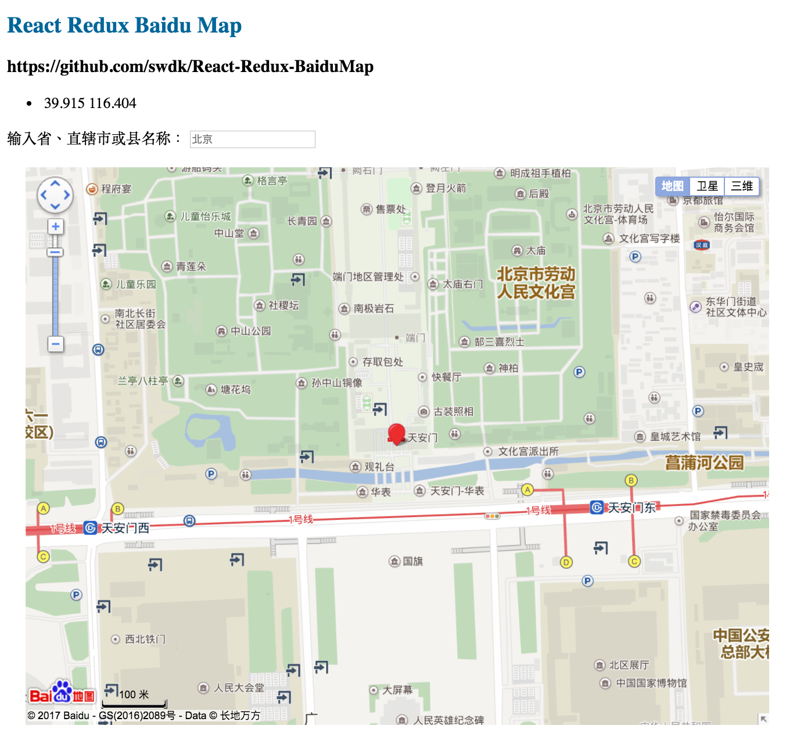
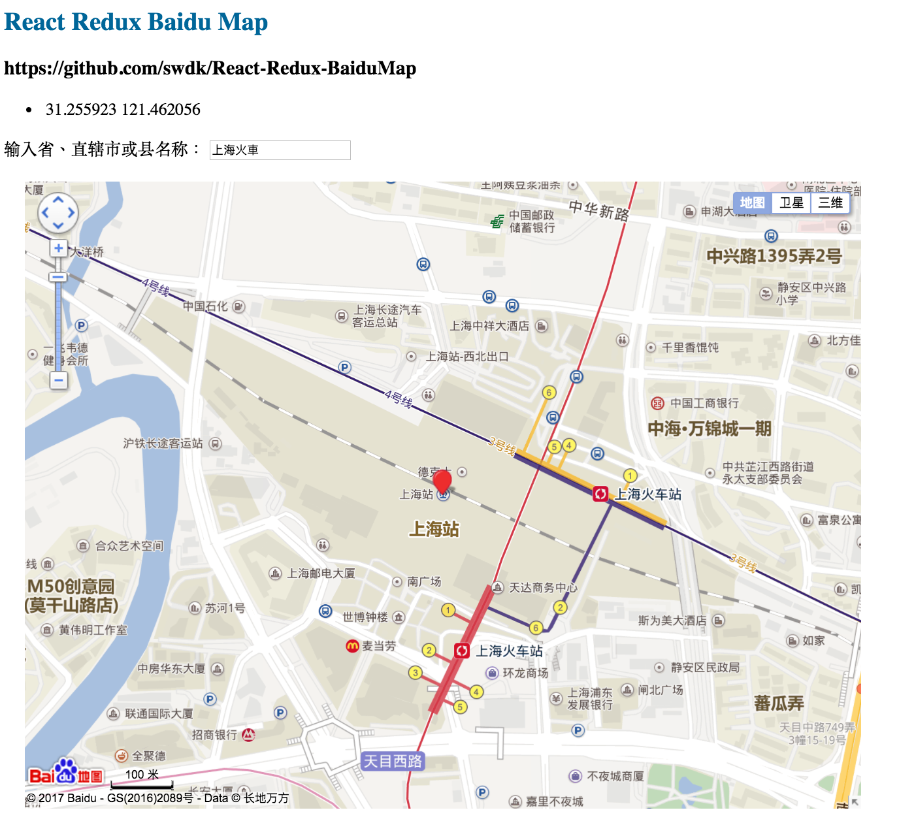

# React/Sass/Redux Boilerplate

Boilerplate and guide for a React/Sass/Redux build. <br/>
Credits to Bucky Roberts for providing this awesome Boilerplate
https://github.com/buckyroberts

## Getting Started

To get started, first install all the necessary dependencies.
```
> npm install
```

Run an initial webpack build
```
> webpack
```

Start the development server (changes will now update live in browser)
```
> npm run start
```

To view your project, go to: [http://localhost:3000/](http://localhost:3000/)

## Drag your Marker, lat and Lng will be displayed


## Real Time Search on Map

